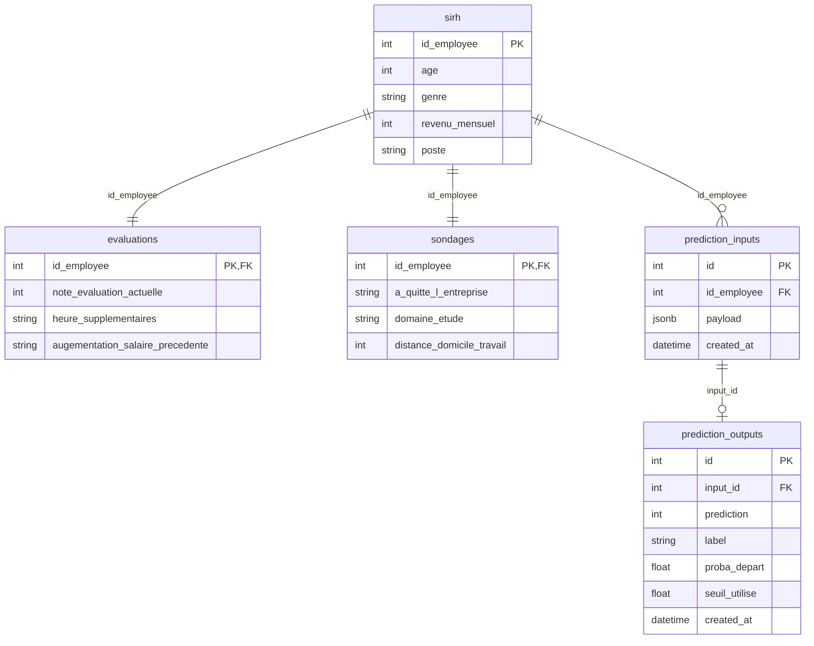

# Schéma de la base Futurisys

Les tables `sirh`, `evaluations` et `sondages` reprennent les 3 CSV du Projet 5 (une ligne = un employé). Les tables `prediction_inputs` et `prediction_outputs` journalisent **chaque** appel au modèle : aucune prédiction sans passage en base.



## Choix techniques

- **3 tables sources** plutôt qu’une seule table dénormalisée : on respecte l’origine des fichiers (SIRH / eval / sondage) et on évite de mélanger contrat, évaluation et cible.
- **`payload` JSONB** : on stocke exactement ce qui a été envoyé au modèle (reproductibilité), sans dupliquer 30 colonnes.
- **Input et output séparés** : la consigne demande des tables dédiées ; on peut auditer un appel même si la prédiction échoue après l’insert input (l’API gérera le rollback).

## Lancer en local

```powershell
copy .env.example .env
docker compose up -d
uv run python -m src.db.create_db
uv run python -m src.db.trace
```
